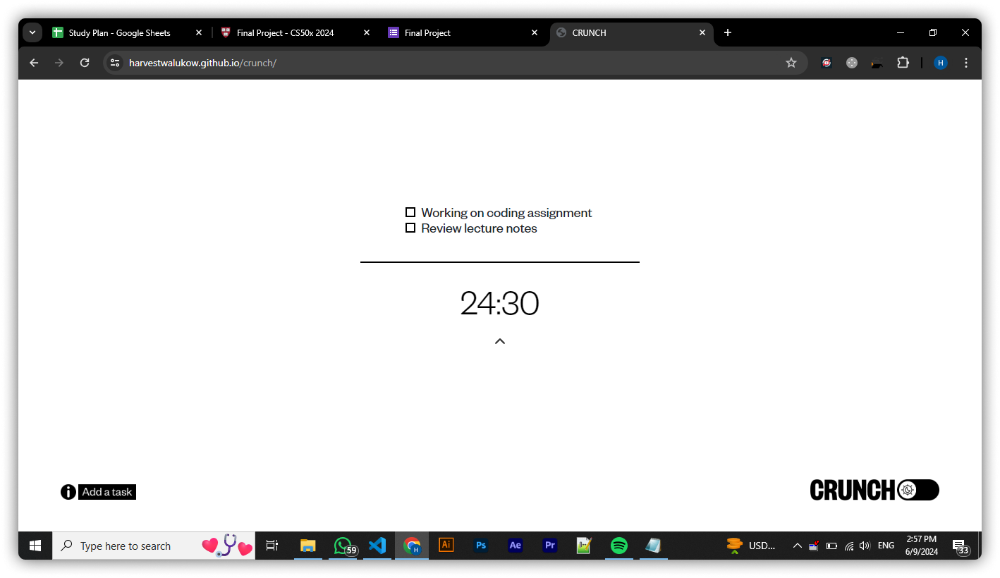

# Crunch - Web App for Productivity

#### Video Demo: https://youtu.be/cbqo8mvz7m0

#### Description:

##### About

Welcome to Crunch, where productivity meets simplicity. Crunch is a suite of tools meticulously designed to boost your efficiency. It's straightforward: create a list of tasks and time yourself as you work through them. Our secret sauce? We harness the power of The Pomodoro Technique, a proven time management method crafted by Francesco Cirillo in the late 1980s. Countless individuals have sworn by its effectiveness in tackling tasks head-on.

##### Using the web app

1. Click the "Add a Task" button to easily create a new task
2. Once your tasks are listed, you can choose to use the Pomodoro timer by clicking the chevron and selecting the timer to begin, or simply proceed without it. The choice is yours!